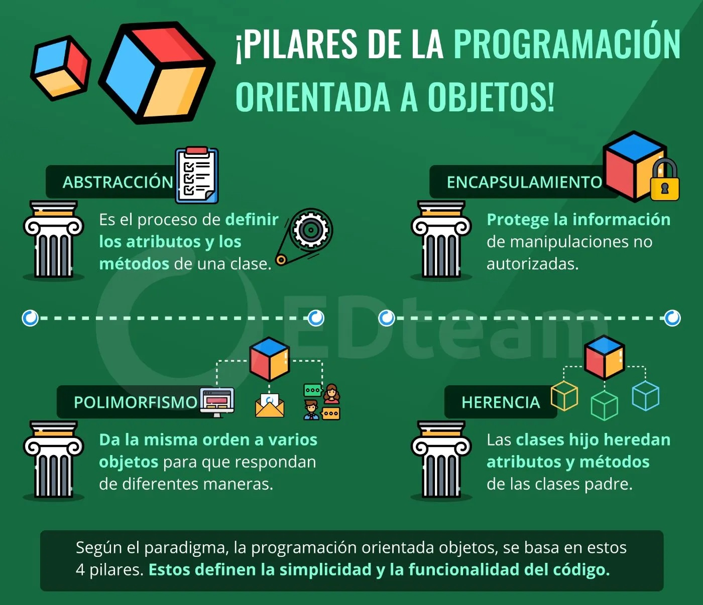
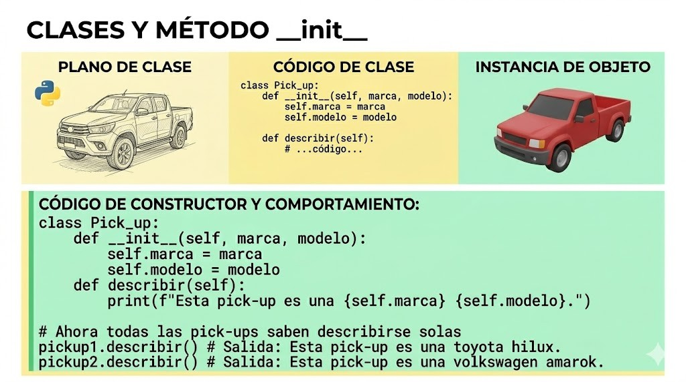
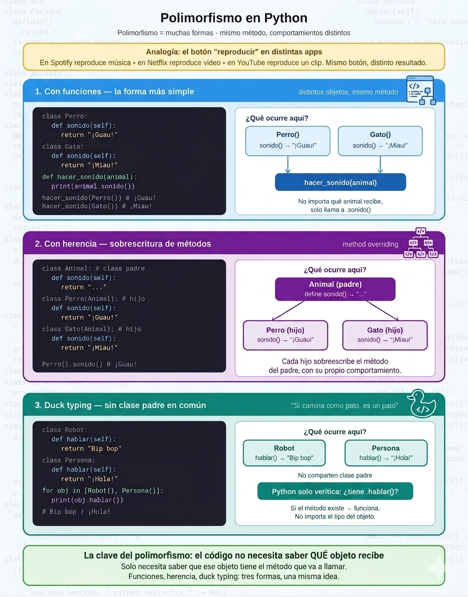
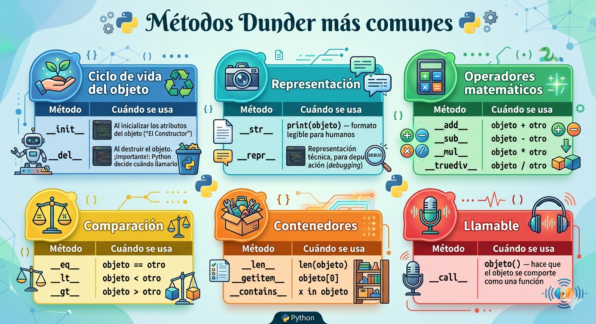
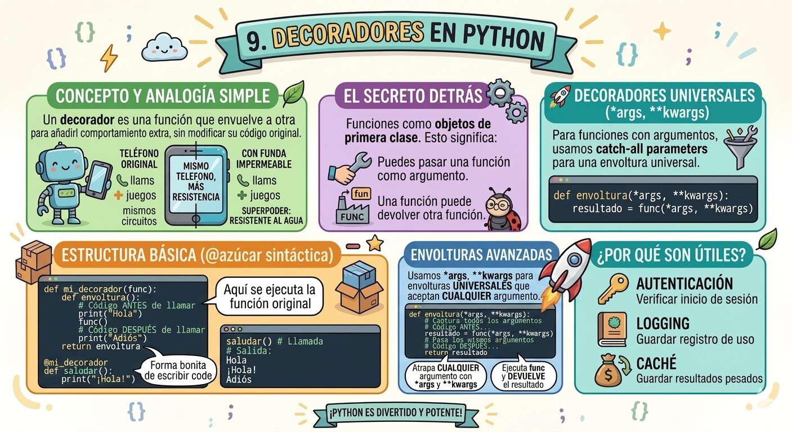
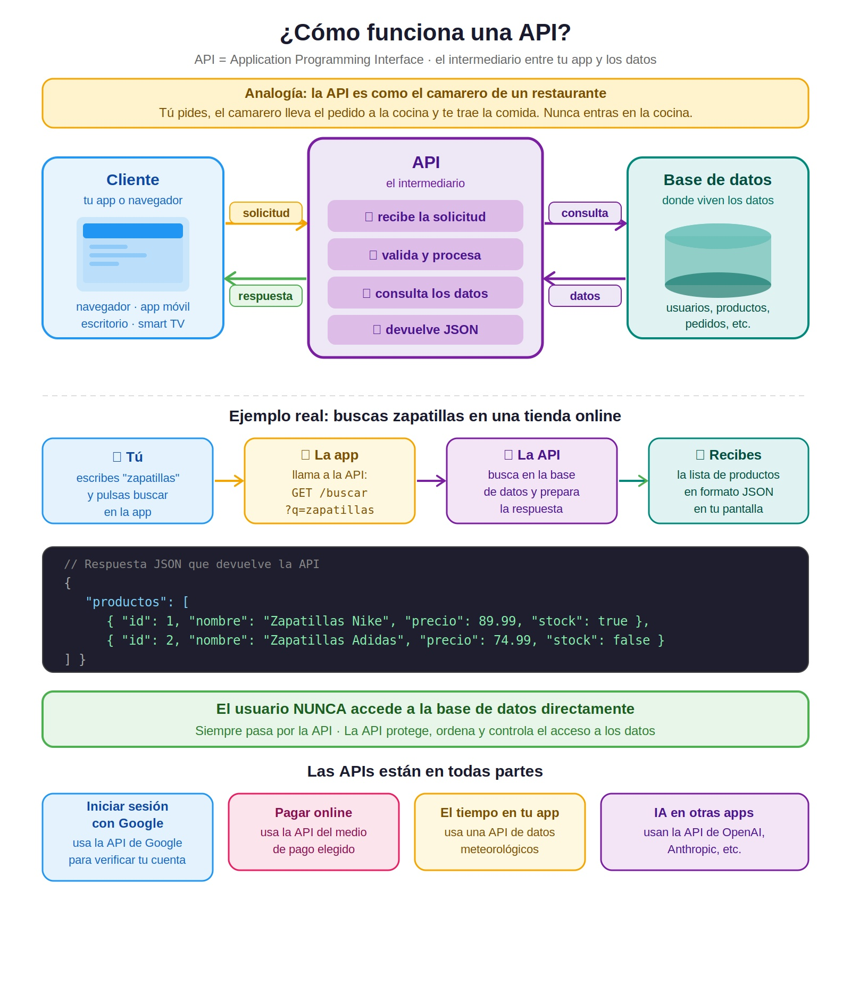
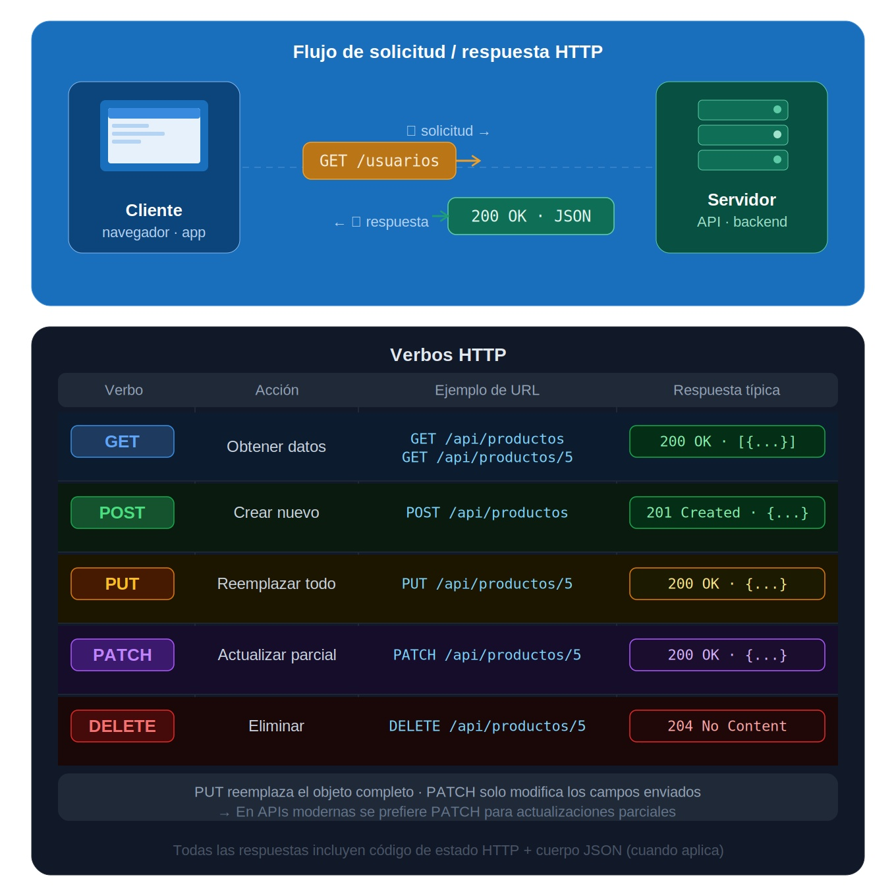
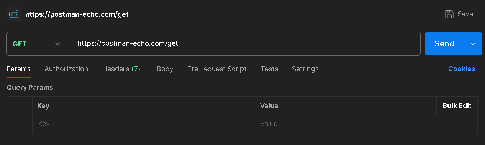
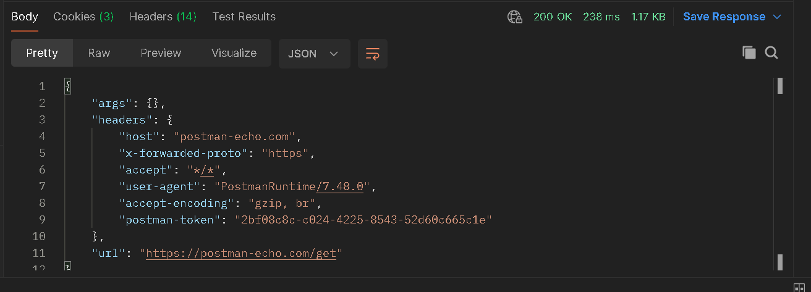
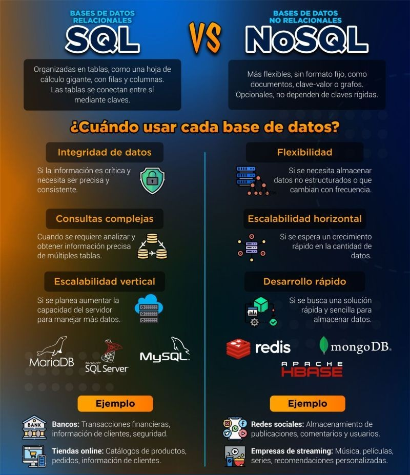

## 🐍 Documentación Python para CheckPoint 6

- **Autor:** Ailén
- **Nivel:** Iniciación
- **Formato:** Markdown
- **Fecha:** Mayo 2026

---

## 📄Tabla de contenidos:

[¿Para qué usamos Clases en Python?](#clases-y-objetos-en-python)
[¿Qué método se ejecuta automáticamente cuando se crea una instancia de una clase?](##el-método-constructor-init)
[¿Qué es el polimorfismo?](#qué-es-el-polimorfismo)
[¿Qué es un método dunder?](#qué-es-un-método-dunder)
[¿Qué es un decorador de python?](#decoradores-en-python)
[¿Qué es una API?](#qué-es-una-api)
[¿Cuáles son los verbos de API?](#verbos-de-apis-en-python)
[¿Qué es Postman?](#postman-el-laboratorio-de-pruebas-de-apis)
[¿Es MongoDB una base de datos SQL o NoSQL?](#base-de-datos-mongodb)


# Introducción a la Programación Orientada a Objetos (POO)

Antes de sumergirnos en el código, es fundamental entender qué sustenta la **Programación Orientada a Objetos**. La POO no es solo una sintaxis de Python, es una forma de **pensar** y **modelar el software** basándose en cuatro pilares fundamentales.

<p align="center">
  
</p>

Esta infografía resume perfectamente estos conceptos que exploraremos en profundidad:

Fuente: EDteam

---

# Clases y objetos en Python

Una *clase* es una **plantilla o molde** que define cómo se creará un objeto. Permiten empaquetar datos (atributos) y comportamientos (métodos) juntos, facilitando asi la aplicación de pilares de la POO, como la Abstracción y el Encapsulamiento.

## Sintaxis Básica

En Python, defines una clase usando la palabra reservada `class` seguida del nombre en mayúscula (CamelCase) y dos puntos (`:`). Todo lo que pertenece a la clase va indentado (con cuatro espacios) debajo.

```python
class NombreClase:
    # Aquí van los atributos y métodos
    pass
```

## ⚙️El método constructor `__init__`

El método que se ejecuta automáticamente cuando se crea una instancia de una clase es `__init__` (abreviación de *initialize*, inicializar en español). En el mundo de la programación, a este tipo de funciones especiales se les conoce como constructores.

Se reconoce porque lleva dos guiones bajos antes y dos después (`__init__`). Esto le indica a Python que es un método especial ("método mágico") con un comportamiento interno propio.

Su función principal es:

- **Darle vida al objeto con datos iniciales:** Configura las características únicas de cada instancia en el momento exacto en que nace.

- **Automatizar procesos:** Evita tener que crear el objeto vacío y luego escribir líneas de código extra para asignarle cada dato uno por uno.

📱 **Analogía de la fábrica:** Imagínate que la clase es el molde para fabricar teléfonos móviles. No queremos que todos los teléfonos salgan de la fábrica vacíos; necesitamos que cada uno tenga su propio número de serie, color y modelo desde el momento en que se fabrican. 

### Ejemplo

```python
class Movil:
    def __init__(self, marca, modelo):
        self.marca = marca
        self.modelo = modelo
        print(f"¡Se creó un móvil {self.marca}!")

mi_movil = Movil("Iphone", "12 mini")
# Se imprime automáticamente: ¡Se creó un móvil Iphone!
```

> 💡 Nota clave: No necesitas llamar a `__init__` manualmente, Python lo hace solo
cuando escribes `Movil("Iphone", "12 mini")`.


### 💡¿Qué significa `self.marca = marca`?

Piénsalo como una ficha de registro:

- `marca` (derecha) → es el dato que llega desde afuera cuando creas el objeto, como "Iphone".
- `self.marca` (izquierda) → es donde ese dato queda guardado dentro del objeto para usarlo después.

No tienen que llamarse igual, pero se hace por convención para que quede claro que son el mismo dato.


### 🔧 ¿Para qué las usamos?

Las mayores ventajas de usar clases son **organizar las funciones en un solo lugar lógico**, **evitar duplicar código** y **modelar el mundo real**.

**Ejemplo sin clases (desorganizado):**
```python
marca_pickup1 = "toyota"
modelo_pickup1 = "hilux"
 
marca_pickup2 = "volkswagen"
modelo_pickup2 = "amarok"
# Si tuviéramos 100 pickups, tendríamos 200 variables sueltas...
```
 
**Ejemplo con clases (organizado):**
```python
class PickUp:
    def __init__(self, marca, modelo):
        self.marca = marca
        self.modelo = modelo

    # Añadimos un método (comportamiento)
    def describir(self):
        print(f"Esta pick-up es una {self.marca} {self.modelo}.")      

 
# Creamos los objetos
pickup1 = PickUp("toyota", "hilux")
pickup2 = PickUp("volkswagen", "amarok")
 
# Ahora todas las pick-ups saben describirse solas
pickup1.describir()  # Imprime: Esta pick-up es una toyota hilux.
pickup2.describir()  # Imprime: Esta pick-up es una volkswagen amarok.
```

<p align="center">
  
</p> 


Con una clase, puedes crear todas las pick-ups que quieras usando el mismo molde.


### ⚠️ Errores comunes al usar clases
 
```python
class Coche:
    def __init__(marca, modelo):   # ❌ ERROR: falta self como primer parámetro
        self.marca = marca
 
class Coche:
    def __init__(self, marca, modelo):   # ✅ CORRECTO
        self.marca = marca
        self.modelo = modelo
```
 
---

# ¿Qué es el polimorfismo?

El polimorfismo es uno de los pilares fundamentales de la Programación Orientada a Objetos (POO), que viste en la infografía inicial. La palabra viene del griego **poly** (muchos) y **morphé** (formas), y en programación significa la capacidad de que **diferentes clases tengan métodos con el mismo nombre pero con comportamientos distintos**.

En Python, el polimorfismo es especialmente flexible y natural gracias al **Duck Typing** (tipado dinámico), que se resume en la famosa frase: *"Si camina como un pato y grazna como un pato, entonces es un pato"*. A Python no le importa el tipo de objeto que sea, sino lo que ese objeto puede hacer.

## Formas de aplicar polimorfismo en Python

A diferencia de otros lenguajes más rígidos, Python ofrece dos maneras principales de aplicar el polimorfismo:


### 1. Con herencia -> un padre define el método, los hijos lo sobreescriben:

```python
class Animal:
    def sonido(self):
        return "..."

class Perro(Animal):
    def sonido(self):
        return "¡Guau!"

class Gato(Animal):
    def sonido(self):
        return "¡Miau!"


print(Perro().sonido())  # ¡Guau!
print(Gato().sonido())   # ¡Miau!
```
> Todos heredan de `Animal`, pero cada uno responde diferente. Esto se llama **sobrescritura de métodos** (*method overriding*).

### 2. Con duck typing -> sin clase padre en común

Python no exige que los objetos compartan una clase padre. Si tiene el método, funciona.

```python
class Perro:
    def sonido(self):
        return "¡Guau!"

class Gato:
    def sonido(self):
        return "¡Miau!"

def hacer_sonido(animal):
    print(animal.sonido())

hacer_sonido(Perro())  # ¡Guau!
hacer_sonido(Gato())   # ¡Miau!

```
> 🔎 Como ves, acá Perro y Gato no tienen ninguna relación familiar (no heredan de nadie en común), pero el polimorfismo funciona igual gracias al Duck Typing.


<p align="center">
  
</p> 


## ¿Por qué es útil?

💡**Ventaja clave:** Te permite escribir código más limpio, flexible y mantenible. Si en el futuro decides añadir una clase `Pájaro` con el método `sonido()`, la función `hacer_sonido()` seguirá funcionando perfectamente sin necesidad de modificar una sola línea de su código.

---

# ¿Qué es un método dunder?

Un **método dunder** (abreviatura en inglés de *double underscore*, o doble guion bajo) es un método especial en Python cuyo nombre comienza y termina con dos guiones bajos (por ejemplo, `__init__` o `__str__`).

También se les conoce como **métodos mágicos**, y sirven para definir cómo deben comportarse tus objetos ante operaciones nativas de Python (como sumarlos, imprimirlos en pantalla o medir su longitud).
Son la base del polimorfismo en Python, ya que permiten que objetos distintos respondan igual ante las mismas operaciones.


## ¿Cómo funcionan? (El "detrás de escena")

No sueles llamar a estos métodos directamente escribiendo `objeto.__str__()`. En su lugar, **Python** los invoca automáticamente por debajo cuando usas ciertos operadores o funciones nativas.

Por ejemplo, cuando haces una suma con el operador +, Python busca el método dunder `__add__`:

| Lo que tú escribes | Lo que Python hace por detrás |
|---|---|
| `objeto1 + objeto2` | `objeto1.__add__(objeto2)` |
| `len(objeto)` | `objeto.__len__()` |
| `print(objeto)` | `objeto.__str__()` |
| `objeto[0]` | `objeto.__getitem__(0)` |

---

<p align="center">
  
</p>

---

## Ejemplos prácticos:

Vamos a crear una clase `Producto` y a darle "superpoderes" usando métodos dunder para poder imprimirlos, compararlos y sumarlos directamente:

```python
# El constructor: inicializa los atributos del objeto
class Producto:
    def __init__(self, nombre, precio):
        self.nombre = nombre
        self.precio = precio

    # Para que print(producto) muestre algo legible
    def __str__(self):
        return f"{self.nombre} ({self.precio}€)"

    # Para comparar si dos productos tienen el mismo precio
    def __eq__(self, otro):
        if isinstance(otro, Producto):
            return self.precio == otro.precio
        return False

    # Para poder sumar el precio de dos productos directamente
    def __add__(self, otro):
        return self.precio + otro.precio

# Probando nuestra clase "mágica"
p1 = Producto("Café", 5)
p2 = Producto("Galletas", 3)
p3 = Producto("Té", 5)

print(p1)          # Invoca __str__ -> Imprime: Café (5€)
print(p1 == p3)    # Invoca __eq__  -> Imprime: True (cuestan lo mismo)
print(p1 + p2)     # Invoca __add__ -> Imprime: 8

```
> Los más usados del día a día son `__init__`, `__str__`, `__repr__`, `__len__` y `__eq__`.

---

# Decoradores en Python

Un **decorador** es una función que envuelve a otra función para añadirle comportamiento extra, **sin modificar su código original**.

> 💡**Analogía simple:** Imagina que un decorador es como la funda impermeable de un teléfono: el teléfono sigue haciendo exactamente lo mismo (llamar, navegar, jugar), pero ahora, gracias a la funda, tiene el "superpoder" de ser resistente al agua sin haber alterado sus circuitos internos.

## El secreto detrás de los decoradores

Para entender los decoradores, primero hay que saber que en Python las funciones son **objetos de primera clase**. Esto significa que:

- Puedes pasar una función como argumento a otra función.

- Una función puede devolver otra función como su resultado.

Por eso un decorador se define como una función que:
- Recibe una función (`func`).
- Crea una función interna (*envoltura* o *wrapper*) que añade la lógica extra.
- Devuelve esa función interna.

**Ejemplo sin decorador:**
```python
def saludar():
    print("¡Hola!")

saludar()  # → ¡Hola!
```

**Ahora con un decorador que añade un mensaje antes y después:**

```python
def mi_decorador(func):
    def envoltura():
        print("1. Algo que se hace ANTES de ejecutar la función.")
        func()  # Aquí se ejecuta la función original
        print("2. Algo que se hace DESPUÉS de ejecutar la función.")
    return envoltura

@mi_decorador
def saludar():
    print("¡Hola!")

saludar()    

# Resultado en consola:
# 1. Algo que se hace ANTES de ejecutar la función.
# ¡Hola!
# 2. Algo que se hace DESPUÉS de ejecutar la función.
```

> 💡**¿Qué es el @?** El `@mi_decorador` es azúcar sintáctica (una forma más bonita de escribir código). Es exactamente lo mismo que escribir de forma manual: `saludar = mi_decorador(saludar)`.


## 🚀 ¿Qué pasa si la función original recibe argumentos?

El decorador básico que vimos arriba solo funciona para funciones que no reciben ningún parámetro. Si intentamos decorar una función que recibe un nombre, por ejemplo, `def saludar(nombre):`, Python nos dará un error.

Para que nuestro decorador sea **universal** y sirva para cualquier función, usamos `*args` (para argumentos posicionales) y `**kwargs` (para argumentos con nombre).

Mira cómo cambia el decorador para aceptar parámetros:

```python
def mi_decorador_universal(func):
    # Ponemos *args y **kwargs para que la envoltura atrape CUALQUIER argumento
    def envoltura(*args, **kwargs):
        print("1. Algo antes...")
        
        # Le pasamos esos mismos argumentos a la función original
        resultado = func(*args, **kwargs)
        
        print("2. Algo después...")
        return resultado # Retornamos el resultado por si la función devuelve algo
    return envoltura

@mi_decorador_universal
def saludar_persona(nombre, saludo="¡Hola!"):
    print(f"{saludo}, {nombre}. ¿Cómo estás?")

# ¡Ahora funciona perfectamente con argumentos!
saludar_persona("Carlos", saludo="Buenas tardes")


#Resultado en consola
# 1. Algo antes...
# Buenas tardes, Carlos. ¿Cómo estás?
# 2. Algo después...
```

## ¿Por qué son tan útiles?

Los decoradores son una de las herramientas más potentes de Python. Se usan constantemente para:

- **Autenticación y seguridad:** Verificar si un usuario ha iniciado sesión antes de mostrarle una página web (muy usado en Flask o Django).

- **Logging:** Guardar un registro de qué funciones está tocando un usuario.

- **Caché:** Guardar el resultado de operaciones pesadas para no tener que repetirlas si se piden los mismos datos.

---
<p align="center">
  
</p>

---

# ¿Qué es una API?

Una **API** (por sus siglas en inglés, Application Programming Interface) o Interfaz de Programación de Aplicaciones, es un conjunto de reglas que permite que diferentes programas o aplicaciones se comuniquen entre sí. Actúa como un **puente o intermediario**, permitiendo que un sistema solicite datos o funciones a otro de forma automática y segura.

## La analogía del restaurante 🍽️

Imagina que estás en un restaurante:

- **Tu** eres la aplicación que quiere algo (el cliente).
- **La cocina** es el sistema que tiene lo que necesitas (el servidor / base de datos).
- **El camarero** es la API: el intermediario que lleva tu pedido, lo comunica a la cocina, y trae la respuesta de vuelta.

> 💡 Tu nunca entras a la cocina. No sabes cómo funciona por dentro. Solo le dices al camarero qué quieres, y él se encarga del resto.
---

## 📱 ¿Cómo funciona en la práctica?

<p align="center">
  
</p>

Cuando abres una app del tiempo y ves la temperatura de tu ciudad, esto es lo que ocurre por detrás:

- ➡️ Tu app le manda una petición (**request**) a una API → "Dame el clima de Bilbao". 
- 🔎 La API busca esa información en su servidor
- ⬅️ La API te devuelve una respuesta (**response**) → generalmente en formato JSON

```json
{
  "ciudad": "Bilbao",
  "temperatura": 18,
  "estado": "lluvia"
}
```

## ¿Por qué son tan importantes para un programador?

Las APIs son los bloques de construcción del software moderno por tres razones principales:

- **No reinventas la rueda:** Si estás creando una app de reparto de comida, no vas a programar un mapa desde cero. Usas la API de Google Maps.

- **Seguridad:** Permiten compartir funciones o datos sin enseñar cómo está hecho tu código por dentro ni exponer tu base de datos directamente al público.

- **Separación de tareas:** Permiten que el equipo de Frontend (los que hacen la interfaz visual en React, HTML, etc.) trabaje de forma independiente al equipo de Backend (los que programan la lógica y las bases de datos en Flask, Node.js, etc.). Ambos mundos se unen gracias a la API.

> 📌 **En Resumen:** Una API es una herramienta que te permite conectar sistemas, usar herramientas de otros creadores en tu propia aplicación, y estructurar tu código de forma limpia y profesional.

---


# Verbos de APIs en Python

Las **APIs REST** son fundamentales en el desarrollo de software moderno. Para interactuar con ellas, utilizamos los **verbos HTTP**, que permiten definir el tipo de acción que queremos realizar sobre los recursos de la API.

## ¿Qué son los verbos HTTP?
 
Los verbos HTTP (también llamados métodos HTTP) indican la acción que se desea realizar sobre un recurso en una API. En una API REST, los recursos suelen representarse como URLs.
Por ejemplo, en una API que gestiona recetas de cocina, el recurso principal sería: https://api.ejemplo.com/recetas

Los verbos HTTP nos permiten:

- Obtener información -> **GET**
- Crear un nuevo recurso -> **POST**
- Actualizar un recurso existente -> **PUT** o **PATCH**
- Eliminar un recurso -> **DELETE**

---

## Verbos HTTP más utilizados en APIs REST

### 1. GET – Obtener recursos

El método **GET** se usa para recuperar información de la API.

- Es un método **seguro**: No modifica ni altera ningún dato en el servidor, solo los lee.
- Es **idempotente**: No importa si haces la misma petición GET 1 vez o 100 veces, el resultado en el servidor siempre será el mismo y no causará efectos secundarios.
- Permite usar parámetros en la URL para filtrar o buscar resultados específicos.

**Ejemplo (Flask):**
```python
#Endpoint para obtener todas las recetas
@app.route("/recetas", methods=["GET"])
def obtener_recetas():
    todas_las_recetas = Receta.query.all()
    resultado = recetas_schema.dump(todas_las_recetas)
    return jsonify(resultado)
```    
>💡 Cuando un cliente (como un navegador web) hace una petición GET a `/recetas`, este código va a la base de datos, trae todas las recetas registradas, las convierte a formato JSON y las devuelve. Es como decirle al servidor: "dame la lista de recetas que tienes guardada".

---

### 2. POST – Crear un nuevo recurso

El método **POST** se usa para enviar datos al servidor y crear un nuevo recurso.

- No es **idempotente**:  Si envías la misma petición POST tres veces, crearás tres registros duplicados en la base de datos.
- La información viaja oculta y segura dentro del **cuerpo (body)** de la solicitud, no en la URL.

**Ejemplo (Flask):**
```python
# Endpoint para crear una nueva receta
@app.route('/recetas', methods=["POST"])
def agregar_receta():
    nombre = request.json['nombre']
    ingredientes = request.json['ingredientes']

    nueva_receta = Receta(nombre, ingredientes)

    db.session.add(nueva_receta)
    db.session.commit()

    return receta_schema.jsonify(nueva_receta)
```

Lo que hace paso a paso:
1. Recibe los datos que enviaste en el body del POST (nombre, ingredientes).
2. Crea un nuevo objeto `Receta` con esos datos.
3. Lo guarda en la base de datos de forma definitiva usando `add()` y `commit()`.
4. Devuelve la receta recién creada en formato JSON para confirmar que se guardó bien.


El body que enviarías desde Postman sería algo así:
```json
{
    "nombre": "Milanesa",
    "ingredientes": "carne, pan rallado, huevo"
}
```
---

### 3. PUT – Reemplazar un recurso completo

El método **PUT** se usa para actualizar un recurso existente reemplazando todos sus atributos por los nuevos datos enviados.

- **Es idempotente**:Si mandas la misma actualización muchas veces, el recurso quedará exactamente igual desde la primera vez.
- Requiere enviar **todos los campos**, no solo los que cambian.
- Si el recurso no existe, algunas APIs lo crean (pero no es recomendable).

**Ejemplo (Flask):**
```python
# Endpoint para actualizar una receta completa por su ID
@app.route("/recetas/<id>", methods=["PUT"])
def actualizar_receta(id):
    receta = Receta.query.get(id)

    #Reemplazar todos los campos obligatorios con los nuevos datos recibidos
    receta.nombre = request.json['nombre']
    receta.ingredientes = request.json['ingredientes']

    db.session.commit()
    return receta_schema.jsonify(receta)
```

Lo que hace paso a paso:

- Recibe el `id` directamente desde la URL, por ejemplo `/recetas/3`.
- Busca la receta con ese `id` en la base de datos.
- Recibe los datos nuevos del body
- Pisa los valores viejos con los nuevos
- Guarda los cambios (`commit`)
- Devuelve la receta actualizada

La diferencia clave con POST es que aquí ya existe el registro, no lo creas sino que lo modificas. En Postman mandarías algo así a `/recetas/3`:    
```json
{
    "nombre": "Milanesa Napolitana",
    "ingredientes": "carne, pan rallado, huevo, tomate, queso"
}
```
---

### 💡 ¿Y qué pasa con PATCH?– Actualizar parcialmente un recurso

A diferencia de PUT (que sobrescribe todo el objeto), el método **PATCH** se utiliza para realizar actualizaciones parciales. Si una receta tuviera 20 campos y solo quieres cambiar el tiempo de cocción, usas PATCH para enviar únicamente ese dato específico, dejando el resto intacto sin necesidad de reescribir todo el JSON.

--- 

### 4. DELETE – Eliminar un recurso

El método **DELETE** se usa para borrar de forma definitiva un recurso del servidor.

- **Es idempotente:** La primera vez que borras el recurso con ID 3, se elimina. Si vuelves a mandar el mismo DELETE al ID 3, el servidor te dirá que ya no existe, pero el estado del servidor no cambia (el recurso sigue borrado).
- Generalmente no devuelve datos, solo un código HTTP (`204 No Content`).

**Ejemplo (Flask):**
```python
# Endpoint para eliminar una receta por su ID
@app.route("/recetas/<id>", methods=["DELETE"])
def eliminar_receta(id):
    receta = Receta.query.get(id)

    db.session.delete(receta)
    db.session.commit()

    # Devolvemos un mensaje de confirmación
    return jsonify({"mensaje": f"La receta con ID {id} fue eliminada con éxito"})
```

Lo que hace paso a paso:

- Recibe el ID por la URL, por ejemplo `/recetas/3`.
- Localiza ese registro en la base de datos.
- La elimina de la base de datos
- Guarda los cambios (`commit`)
- Devuelve un mensaje JSON confirmando la acción. 

> Es el método más limpio, ya que no necesita un cuerpo de datos, solo apuntar al ID correcto.

---

### Resumen de los verbos HTTP

<p align="center">
  
</p>

 
---

# Postman: el laboratorio de pruebas de APIs

**Postman** es, sin duda, la herramienta estrella para cualquiera que trabaje desarrollando o consumiendo APIs. Si estás construyendo tu propio backend o necesitas usar datos de un servicio externo, Postman va a ser tu mejor amigo. 

> 💡**Importante:** Es **gratuito** y se descarga como **aplicación de escritorio**.

## ¿Qué es Postman? 

**Postman** es una herramienta visual que te permite **probar APIs sin necesidad de escribir código**. Funciona como un laboratorio de pruebas para APIs.

Imagina que estás programando el backend de tu aplicación con Python y Flask, y creas una ruta para que los usuarios puedan registrarse. En una situación normal, para probar si esa ruta funciona, tendrías que programar también la pantalla del frontend (el formulario en HTML/CSS), escribir los datos, hacer clic en el botón y ver qué pasa.

Postman existe para evitarte todo ese trabajo. Te permite **simular ser el frontend** y enviar peticiones directas a tu backend para comprobar si responde correctamente.

## ¿Para qué sirve? (Sus 3 usos principales)

- 💉 **Probar APIs (Testing)**: 
Te permite enviar peticiones (`requests`) a cualquier URL y analizar minuciosamente la respuesta (`response`). Puedes ver qué datos te devuelve, en qué formato (generalmente JSON), cuánto tarda en responder y si el código de estado es el correcto (como un 200 OK o un 404 Not Found).

- 🔧 **Diseñar y Desarrollar APIs**: 
Mientras estás escribiendo el código de tu servidor, utilizas Postman para asegurarte de que cada "ruta" o endpoint hace exactamente lo que querés antes de conectarla con la interfaz visual.

- 📁 **Documentar y Organizar (Colecciones)**: 
Postman te permite guardar tus peticiones en carpetas llamadas Collections (Colecciones). Si tu aplicación tiene 20 rutas diferentes (para usuarios, para productos, para el carrito), podés guardarlas todas organizadas. Incluso puedes compartir esa colección con otros programadores para que sepan cómo usar tu API.

## ¿Cómo funciona Postman?

El funcionamiento de Postman replica exactamente el flujo de **Petición ➡️ Respuesta** que viste al estudiar las APIs, pero ofreciéndote una interfaz gráfica muy cómoda.

### Ejemplo práctico paso a paso:

Haremos una búsqueda del siguiente link de muestra que nos ofrece la plataforma web: `https://postman-echo.com/get`


1. Selecciona el método **GET** en el menú desplegable que se encuentra a la izquierda de la barra de búsqueda.

2. Coloca la URL de prueba (`https://postman-echo.com/get`) en el panel de búsqueda superior.

3. Presiona el botón azul **Send** ubicado a la derecha.

> 💡 **Tip:** Si deseas guardar esta configuración para no tener que escribirla de nuevo en el futuro, puedes presionar el botón **Save** que se encuentra en la parte superior derecha.

<p align="center">
  
</p>


### Analizando la Respuesta

Una vez que presionas **Send**, la mitad inferior de Postman te mostrará el resultado del servidor. En esa zona deberás buscar tres datos fundamentales:

- El **JSON de respuesta** (con colores y sangrías para que se lea fácil).

- El **Status Code** (el número que indica si todo salió bien o hubo un error).

- El **Tiempo de respuesta** (útil para ver si tu base de datos o tu código están yendo lentos).

<p align="center">
  
</p>

## 📌 La Analogía Final

Si dijimos que una API es el camarero de un restaurante que lleva los pedidos de la mesa a la cocina...

**Postman es un cliente experto** que se sienta en la mesa con un cuaderno, le pide cosas rarísimas al camarero de todas las formas posibles (platos sin sal, menús espaciales, cosas que no están en la carta) para comprobar si el camarero hace bien su trabajo y si la cocina responde correctamente a cada situación.

> 📌 **En resumen:** Postman es el entorno de pruebas de las APIs. Así como usás el navegador para probar una web, usás Postman para probar una API.

---

# Base de datos MongoDB

## ¿Qué es MongoDB?

**MongoDB** es una base de datos **no relacional** (también llamada **NoSQL**), y más concretamente del tipo **orientada a documentos**. 

> En lugar de guardar los datos en tablas con filas y columnas, los guarda en **documentos** con formato similar a JSON, llamados BSON.

## ¿Cómo funciona MongoDB?

Para entenderlo, piensa en cómo guardas la información en carpetas de tu ordenador usando archivos de texto editables.

MongoDB utiliza el formato **BSON** (que es una versión binaria de JSON, el estándar de la web). Si alguna vez has visto un JSON, se estructura con pares de `clave: valor`.

### Jerarquía básica
 
| Concepto | Equivalente en SQL | Descripción |
|---|---|---|
| **Documento** | Fila | El registro individual |
| **Colección** | Tabla | El grupo donde se guardan los documentos |

Así se vería un documento:

```json
{
  "_id": "64f1a2b3c4d5e6f7a8b9c012",
  "nombre": "Carlos",
  "edad": 28,
  "hobbies": ["fútbol", "videojuegos"],
  "direccion": {
    "ciudad": "Madrid",
    "pais": "España"
  }
}
```
> 💡 Fijate que el documento puede tener **listas**, **objetos anidados** y campos distintos entre documentos. No hay una estructura rígida obligatoria.

---
 
## Características principales

- **🔓 Esquema flexible**: Cada documento puede tener campos diferentes. No es obligatorio seguir una estructura rígida, lo que facilita la evolución de tu aplicación.
- **⚡ Alto rendimiento y escalabilidad**: Está diseñada para manejar grandes volúmenes de información y cargas de trabajo masivas.
- **🔎 Lenguaje de consultas enriquecido**: A pesar de ser no relacional, permite realizar consultas complejas, filtrado y agregación de datos.
- **🚀 Baja latencia**: Ideal para aplicaciones web, móviles, e-commerce y redes sociales que requieren respuestas en tiempo real.

---

## La gran batalla: SQL vs. NoSQL

Para entender por qué existe MongoDB, hay que compararlo con el modelo tradicional (SQL).

### Bases de Datos SQL (Relacionales)

> Son las mas tradicionales: **MySQL**, **PostgreSQL** o **SQL Server**.

- **Cómo funcionan:** Organizan los datos en tablas con filas y columnas fijas. Las tablas se "relacionan" entre sí mediante llaves o identificadores.
- **Su punto fuerte:** Son increíblemente organizadas y seguras para transacciones complejas (como un sistema bancario).
- **Su limitación:** Son inflexibles. Añadir una nueva columna a una tabla con millones de registros puede convertirse en un problema serio.

### Bases de datos NoSQL (No Relacionales)

> Aquí es donde entra **MongoDB**. Nacieron para resolver los problemas de rigidez y escalabilidad de la era de internet.
 
- **Cómo funcionan:** No usan tablas. Pueden usar documentos (como MongoDB), grafos, o sistemas clave-valor.
- **Su punto fuerte:** Son **flexibles** y escalan **horizontalmente** sin fricción (es muy fácil repartir los datos en muchos servidores si tu aplicación crece de golpe).


### Comparativa rápida

<p align="center">
  
</p>


 > **En resumen:** MongoDB te da **flexibilidad y velocidad** a cambio de renunciar a la rigidez estructurada del mundo relacional. Ninguna es mejor en absoluto, depende del problema que quieras resolver.

---

# 📚 Cierre
A lo largo de esta documentación recorrimos los pilares de la Programación Orientada a Objetos, desde cómo modelar el mundo real con clases hasta cómo comunicar aplicaciones entre sí mediante APIs. Estos conceptos — clases, polimorfismo, dunders, decoradores, APIs y bases de datos — no son temas aislados: en el desarrollo web moderno aparecen juntos constantemente.


